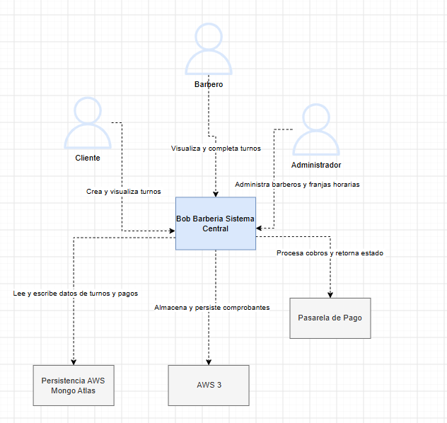
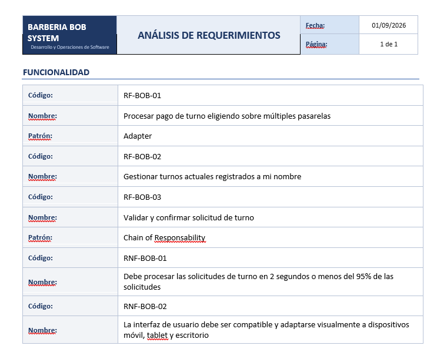
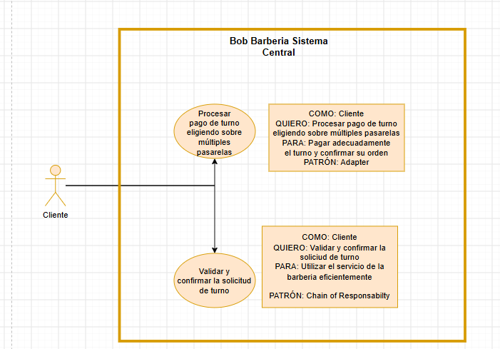

# DOSW_Parcial_T1_JuanGaitan

LINK BITACORA 

https://github.com/mamagege/BitacoraDOWS.git

# JUAN DIEGO GAITÁN 
# DOWS GRUPO 01

# DESAROLLO PARCIAL#2

# DIAGRAMA DE CONTEXTO C4:

# IDENTIFICACIÓN REQUERIMIENTOS

# DIGRAMA DE CASOS DE USO
Para requerimientos RF-BOB-01 Y RF-BOB-03

# Descomposición de tareas:

# Nombre del sistema : BOB BARBERY

## 1.ÉPICA
Procesamiento de múltiples metodos de pago para creación de turno

"Los clientes desean pagar con los métodos de pago dispoibles para completar la creación de su turno"

## 2. FEATURE 
Procesamiento del pago con flujo a pasarela de pago correspondiente

"El cliente elige Nequi como método de pago y oprimer el botón de pagar"

## 3. HISTORIA DE USUARIO

Pago de turno utilizando pasarela Nequi.

COMO cliente con un turno pre-aprobado

QUIERO seleccionar Nequi como método de pago para pagar

PARA procesar la transacción y confirmar mi turno.

## Criterios de Aceptación para la HISTORIA DE USUARIO

DADO que el cliente se encuentra en la pantalla de pago y selecciona "Nequi".

CUANDO ingresa un número de celular terminado en "65" y oprime "Pagar".

ENTONCES el sistema debe comunicarse con la pasarela de Nequi.

## 4.TAREAS 

Tarea 1: Crear la interfaz abstracta procesarPago() que defina el contrato para la respuesta normalizada con patrón Adapter.
Tarea 2: Escribir las pruebas unitarias para validar que NequiAdapter retorna RECHAZADO si el celular no termina en 65.
Tarea 3: Implementar el componente visual responsivo de la tarjeta de Nequi.

# DESGLOSE DE PATRONES: 

ADAPTER: ESTRUCTURAL
CHAIN OF RESPONSABILTY: COMPORTAMENTAL

## JUSTIFICACIÓN: 
ADAPTER: El sistema debe integrarse con Nequi (API REST propia), PSE (SDK bancario legado) y Stripe, los cuales tienen firmas de métodos (sendpayment, executeBankTransaction, charge) y respuestas totalmente incompatibles. El patrón Adapter se usa como "puente adaptador"para traducir estas respuestas dispares a un único contrato interno normalizado: {payment_Id, estado, mensaje}.  

## Principios SOLID que aplica:

DIP (Inversión de Dependencias): El sistema central de la barbería no depende de los SDKs concretos de Nequi o Stripe, sino de una abstracción/interfaz.

OCP (Abierto/Cerrado): Si mañana Bob's Barber añade PayPal, simplemente se crea un PayPalAdapter nuevo sin modificar ni una línea del código central de pagos.

CHAIN OF RESPONSABILITY:  La confirmación de un turno exige 5 validaciones estrictas y secuenciales. Si se usa un modelo tradicional, el código terminaría en un bloque masivo de if-else anidados. Este patrón permite encadenar estas validaciones como peticiones independientes; si uno falla , detiene el proceso y retorna el error de inmediato.  

Principios SOLID que aplica:

SRP (Responsabilidad Única): Cada manejador (Es decir la petición) hace una sola cosa. Es decir ignorar lo que sucede internamente con las demás peticiones.  

OCP (Abierto/Cerrado): El caso de estudio exige "permitir agregar nuevas validaciones sin modificar el flujo principal". Con este patrón, si se requiere una validación nueva como por ejemplo: "Validar fidelidad cliente"  solo se crea una nueva petición y se inserta en la cadena.  

