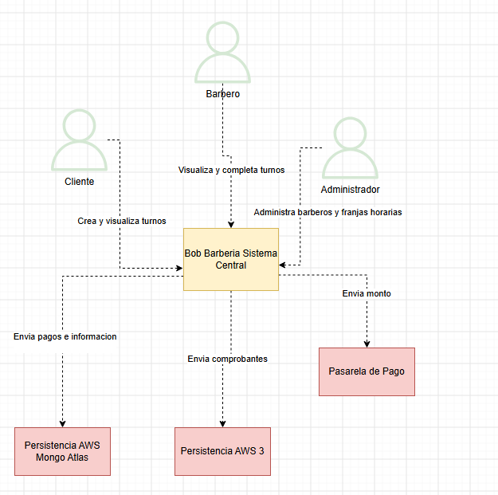
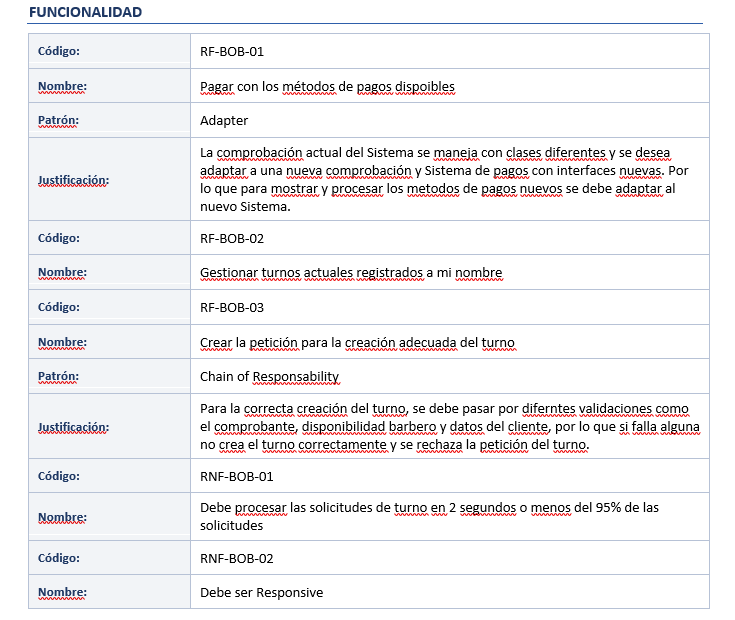
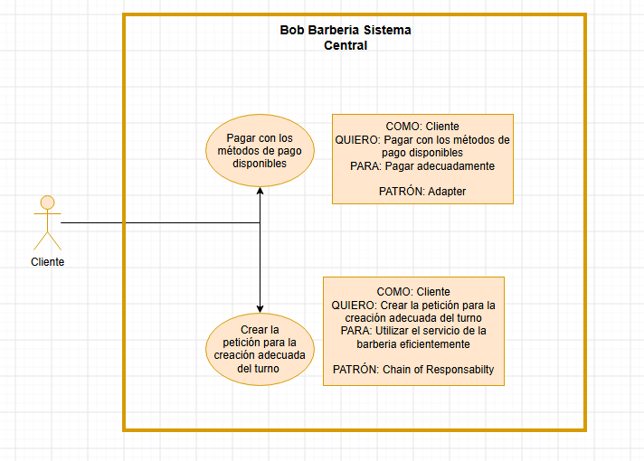

# DOSW_Parcial_T1_JuanGaitan

LINK BITACORA 

https://github.com/mamagege/BitacoraDOWS.git

# JUAN DIEGO GAITÁN 
# DOWS GRUPO 01

# DRAW IO PRUEBA

---

# FIGMA PRUEBA

# DESAROLLO PARCIAL#2

# DIAGRAMA DE CONTEXTO C4:

# IDENTIFICACIÓN REQUERIMIENTOS

# DIGRAMA DE CASOS DE USO
Para requerimientos RF-BOB-01 Y RF-BOB-03

# Descomposición de tareas:

# Requerimiento Elegido: 

RF-BOB-01
Pagar con los métodos de pago disponibles

*PATRÓN USADO* : Adapter

## ÉPICA: BOBS BARBERY

Los clientes desean pagar con los métodos de pago dispoibles para completar la creación de su turno

## FEATURE: 

El cliente elige Nequi como método de pago y oprimer el botón de pagar"

## Historia de Usuario: 

COMO cliente QUIERO elegir Nequi como metodo de pago para confirmar mi turno creado"

## Criterios de aceptacion:

DADO que el cliente eligió Nequi como método de pago CUANDO oprime "Pagar" luego de seleccionarlo
ENTONCES debe transferirse a la pasarela de pago para recibir NEQUI.

## Tareas: 

- Integrar el API de NEQUI para trasnferir a la pasarela de pagos de NEQUI
- Listar los metodos de pago disponibles para mostrar al cliente con UI responsive
- Adaptar el sistema de pagos Legacy con el nuevo sistema de pago con Adapter

# DESGLOSE DE PATRONES: 

ADAPTER: ESTRUCTURAL
CHAIN OF RESPONSABILTY: COMPORTAMENTAL

## JUSTIFICACIÓN: 

ADAPTER: El patrón permite crear una clase intermedia que sirve como traductor entre clases antiguas y clases nuevas a implementar
En el contexto de Bobs Barbery, el sistema actual maneja 4 pasarelas de pago pero entre ellas y sus interfaces hay incompatibilidad

https://app.diagrams.net/#G1rkeHcdPIK4hEpAF5BNMRbev87cYCzm2B#%7B%22pageId%22%3A%22FTWMp4Kn47--Qjpz7caF%22%7D

